<!-- .slide: class="titlepage" -->
<div class="titlebox">

# Towards an Encyclopedia of Programming Languages Anchored in Software Heritage &amp; CodeCommons

<p>Every Programming Language, with Its Real Programs</p>
</div>

<p class="author">Mathieu Acher</p>
<p class="date">CodeCommons plenary meeting · Inria Paris · 28 September 2026</p>

<div class="logos">


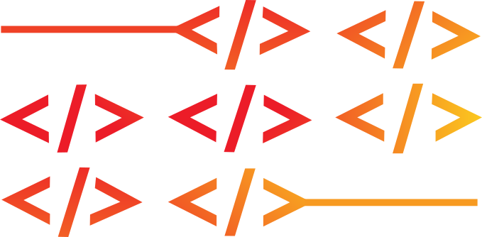
<span style="font-weight: 700; font-size: 0.6em; margin-left: -1em">CodeCommons</span>
</div>

<p class="smallest" style="margin-top: 0.8em">PL Catalog: blog.mathieuacher.com/PL-ultimate-llm · github.com/acherm/PL-ultimate-llm</p>

Note: ⏱ T+0 — 20 minutes, four parts: four partial views of "all programming languages"; the vision (anchor each language in Software Heritage); a zoom on single file extensions, which is a separate, MSR-style contribution; and how we turn this into an official, sustainable initiative. I end with concrete asks.

---

## The encyclopedia today: a working prototype <span class="sub">PL Catalog · blog.mathieuacher.com/PL-ultimate-llm</span>

<div class="cols" style="align-items: flex-start; gap: 0.8em">
<div style="flex: 1">
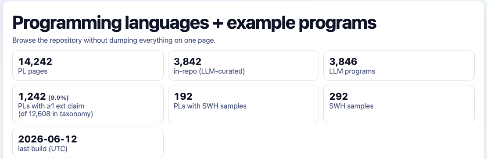
<p class="smallest center" style="margin: 0.2em 0 0.6em">14,242 language pages, cross-referenced with 7 sources + LLM contributions</p>
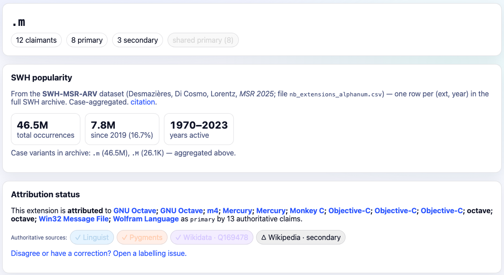
<p class="smallest center" style="margin-top: 0.2em">One page per extension: claimants, SWH popularity, attribution status</p>
</div>
<div style="flex: 1">
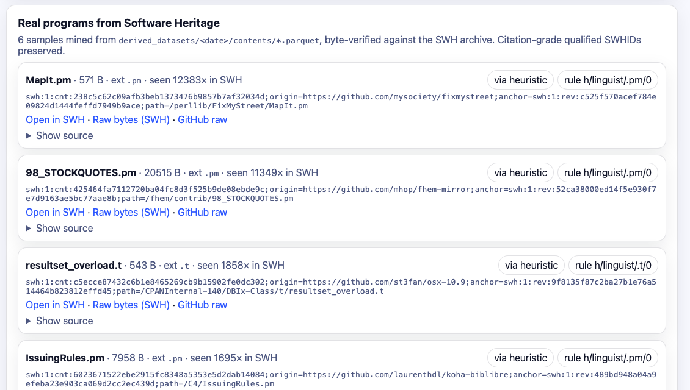
<p class="smallest center" style="margin: 0.2em 0 0.6em">Real programs from SWH: qualified SWHID + the rule that attributed them</p>
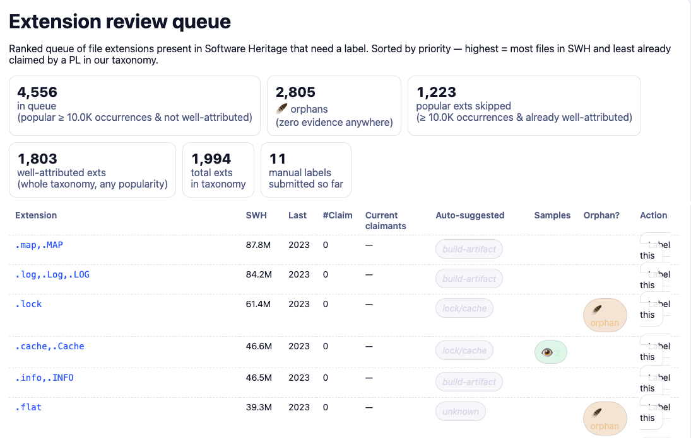
<p class="smallest center" style="margin-top: 0.2em">A review queue: 4,556 popular extensions waiting for a label</p>
</div>
</div>

Note: ⏱ T+0:20 — Start from what exists. A static site, rebuilt from git on every push, live at blog.mathieuacher.com/PL-ultimate-llm/. 14,242 language pages; ~190 languages already have real programs from Software Heritage (~290 files), each with a citable qualified SWHID and the identification rule that fired. Everything on the site can be contributed to through forms that become GitHub issues and pull requests. Prototype quality, but the shape of the encyclopedia is there.

---

## What the encyclopedia offers <span class="sub">Features of the current prototype</span>

<div class="cards three">
<div class="card">
<h3>Browse &amp; search</h3>
<ul>
<li>14,242 language pages, A–Z, search by name or alias</li>
<li>filters: has an SWH program, has an LLM program, number of sources</li>
<li>one page per source: what is only in Esolang?</li>
</ul>
</div>
<div class="card">
<h3>A page per language</h3>
<ul>
<li>which sources attest it</li>
<li>Wikipedia / Wikidata facts: designer, year, influences</li>
<li>claimed extensions, with source, strength and SWH counts</li>
<li>real programs from SWH: qualified SWHID + the rule that fired</li>
</ul>
</div>
<div class="card green">
<h3>Tools &amp; agents, three jobs</h3>
<ul>
<li><b>find languages</b>: 7 catalogs, Wikidata candidates, LLM agents</li>
<li><b>label programs</b>: PLI tools (Linguist rules, Pygments, Synid), LLM judges, human reviews</li>
<li><b>find programs</b>: SWH mining per extension, sample requests</li>
</ul>
</div>
<div class="card">
<h3>A page per extension</h3>
<ul>
<li>claimants and attribution status (well / weakly attributed, polysemous, orphan)</li>
<li>SWH popularity, case variants (<code>.R</code> vs <code>.r</code>)</li>
<li>Linguist disambiguation rules</li>
</ul>
</div>
<div class="card">
<h3>Contribute &amp; review</h3>
<ul>
<li>add a language, add a program, label an extension, request SWH samples</li>
<li>forms → GitHub issues → merged, auditable</li>
<li>review queue, candidates from Wikidata (391)</li>
</ul>
</div>
<div class="card">
<h3>Transparency</h3>
<ul>
<li>every fact is a file in git, every claim has a source</li>
<li>statistics: sources, models, agents</li>
<li>recent submissions, one-line revert</li>
</ul>
</div>
</div>

Note: ⏱ T+1:20 — The feature list, grouped. The key idea is the green block: many tools, of different kinds (catalogs, PLI tools, LLMs, people), do three jobs: find languages, label programs with a language, find programs for a language. Each output is recorded with its provenance, so the site can show disagreement instead of hiding it. (The LLM game also produces example programs for each language; they document what a model knows, and are kept apart from archived programs.)

---

## The dream: every language, with its real programs <span class="sub">The big picture</span>

<div class="cols" style="align-items: center">
<div class="left smaller" style="flex: 1.02">

A **comprehensive, living encyclopedia** of programming languages, **together with their programs in Software Heritage**, from ENIAC to last week's DSL.

- **Exhaustive**: history included (HOPL, Esolang, PLDB, Linguist…)
- **Anchored in code**: citable SWHIDs, or a reasoned **evidence of absence**
- **Traceable**: every claim says who asserts it, and why
- **Living**: humans, AIs and automatic procedures add, correct, validate
- **Sustainable**: carried by SWH × CodeCommons, not a side project

<p class="slogan">Every language with its programs, every program with its language.</p>

</div>
<div style="flex: 0.98">
<div class="evcard">
<div class="evtitle">COBOL <span>1959 · CODASYL</span></div>
<div class="evrow"><span class="st y">◐</span><b>Lineage</b> FLOW-MATIC, COMTRAN, FACT… → COBOL → PL/I <span class="dim">(HOPL)</span></div>
<div class="evrow"><span class="st ok">✓</span><b>Sources</b> PLDB · Linguist · Pygments · Wikidata</div>
<div class="evrow"><span class="st ok">✓</span><b>Extensions</b> <code>.cob .cbl .CBL .cpy</code>, case matters</div>
<div class="evrow"><span class="st ok">✓</span><b>Programs</b> ≈150,600 genuine files, 6,278 repos, SWHIDs</div>
<div class="evrow"><span class="st y">◐</span><b>Usage over time</b> <span class="dim">raw counts, COBOL extensions</span></div>
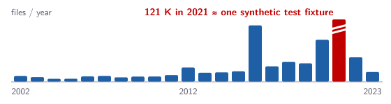
<div class="evrow"><span class="st ko">○</span><b>Dialects, domains, papers</b> <span class="dim">at archive scale: to build</span></div>
<div class="evlegend">✓ available today · ◐ partial · ○ to build</div>
</div>
</div>
</div>

Note: ⏱ T+2:10 — Then the big picture. What we want: one page per language, for all of them, historical and current, esoteric and industrial, where claims are sourced and programs are real archived files. The card is COBOL as it could look: most rows already exist in pieces (catalog, extension study), lineage is scraped from HOPL but not merged, usage over time is still raw counts. The red bar is a teaser: 121K files in 2021, almost all from one synthetic GitLab test fixture (110K files, see part 3); raw counts are not usage. Sustainability is the point of this talk: HOPL shows what happens to a one-person resource (frozen since 2005, often offline).

---

## Why now, and why it matters

<div class="cards" style="margin-bottom: 0.55em">
<div class="card green" style="font-size: 0.6em">
<h3>✓ The right time</h3>
<ul>
<li><b>Software Heritage exists</b>: the largest archive of source code, with citable identifiers, and CodeCommons to analyse it at scale. A unique opportunity</li>
<li><b>The technology is here</b>: PLI tools (Linguist, Synid, Tree-sitter), LLMs to propose and annotate, review and collaboration tools</li>
<li>→ we can map every language to its programs, and every program to its language</li>
</ul>
</div>
<div class="card red" style="font-size: 0.6em">
<h3>✗ The status quo</h3>
<ul>
<li><b>Many ad-hoc attempts</b>: HOPL, PLDB, Esolang, Wikipedia lists, Linguist, Rosetta Code… each with its own idea of "a language"</li>
<li><b>Loosely connected</b>: no shared identifiers, names that don't match, no link to real code</li>
<li><b>Fragile</b>: one-person efforts freeze or go offline (HOPL: frozen around 2005, often down)</li>
</ul>
</div>
</div>

<div class="cards three mini">
<div class="card"><h3>🏛️ Heritage</h3><p>what ALGOL, COBOL or Icon code really looked like</p></div>
<div class="card"><h3>🔬 Science of programming</h3><p>adoption, evolution and death, per language</p></div>
<div class="card"><h3>🤖 AI &amp; LLMs</h3><p>benchmarks and data for low-resource languages</p></div>
<div class="card"><h3>🧰 Tools &amp; SWH</h3><p>search and statistics by language; ground truth for PLI</p></div>
<div class="card"><h3>🏭 Legacy &amp; industry</h3><p>where is the COBOL, RPG, PL/I code, in which dialects?</p></div>
<div class="card"><h3>🎓 Education &amp; citation</h3><p>real, citable programs (SWHIDs) in papers and textbooks</p></div>
</div>

Note: ⏱ T+3:10 — Two arguments. Positive: it is the right time; Software Heritage is a unique asset, and the tools to scale (PLI, LLMs, collaborative review) finally exist. Negative: what exists today is a collection of ad-hoc attempts, loosely connected, often fragile. Then six audiences, one resource. Science: the MSR 2025 study (Desmazières, Di Cosmo, Lorentz) gave 50 years of evolution per extension; we want it per language. AI: the previous talk showed agents manage 17/17 languages on a chess engine, but the subtleties vary widely; a catalogue with real programs is the instrument to measure that on 12,000 languages, not 20. Tools: SWH needs to know which language each file is in to offer search and statistics; that requires a taxonomy and validated labels.

---

## Where are all the Icon programs? <span class="sub">Reality check</span>

<div class="cols" style="align-items: flex-start">
<div class="left smaller" style="flex: 0.88">

**Icon** (Griswold, 1977): generators, goal-directed evaluation, string scanning.

- **HOPL** knows its family: 21 relations (SNOBOL4, SL5, Unicon, Python…)
- **5 catalogs** list it (PLDB, Pygments, Wikipedia, Rosetta Code, Wikidata)
- **An LLM** (Llama 3.1 70B) added it, with a program that defines `main` three times
- **0** verified Icon program in the catalog so far

</div>
<div style="flex: 1.12">

| | `.icn` | `.icon` |
|---|---|---|
| files in SWH | 32,257 | 19,184 |
| Pygments says | Unicon | Icon |
| what they really hold* | Icon **and** Unicon sources (the official Icon repository alone: ~1.2K) | mostly **not** Icon: icon-theme metadata, icon images; the Icon code comes mainly from **one** Rosetta Code dump |

<p class="smallest">* GitHub code search, Sept. 2026: ~9.3K <code>.icn</code> files; ~56K <code>.icon</code> files, of which ~16.5K icon-theme metadata and ~1.3K with Icon code (667 in one Rosetta Code dump).</p>

</div>
</div>

<p class="smaller" style="margin-top: 0.3em">Finding Icon's programs needs <b>automated tools and supervised methods</b> (which extension? which content? Icon or Unicon?) that <b>scale to all of Software Heritage</b>: a challenge, and an opportunity.</p>

Note: ⏱ T+4 — Back to reality, with a running example. Icon: I used it as a student, a compiler teacher challenged us with it. It has a rich history (HOPL, papers, including a retrospective that asks why it did not take off). Every source knows *something* about Icon. None of them can point to the Icon programs that actually exist. The Llama 3.1 70B program is plausible-looking but would not even link (three `procedure main()`). The SWH counts come from the SWH-MSR-ARV dataset: extensions are counted, languages are not. The extensions are a trap: Icon source files use .icn (the Icon translator takes .icn files), and so does Unicon, Icon's object-oriented successor, so .icn needs content-level disambiguation (e.g. class, package, import are Unicon). .icon, which Pygments assigns to Icon, mostly holds something else: freedesktop/GTK icon-theme metadata files ([Icon Data]), icon images; the Icon code that does use .icon comes largely from the acmeism/RosettaCodeData dump, which names files after the language. In practice Pygments' mapping is inverted. Numbers from GitHub code search (default branches only), to be confirmed on SWH.

---

<!-- .slide: class="section-slide" -->
# 1. Four mirrors, no code
## HOPL · PL-ultimate · PL-ultimate-llm · SWH file extensions

Note: ⏱ T+4:45 (block 1, ~5 min) — Four initiatives from the last months. Each shows one side of the question; none shows the code.

---

## HOPL: a genealogy, frozen in 2005 <span class="sub">Mirror 1 · history</span>

<div class="cols" style="align-items: center">
<div class="left smaller" style="flex: 1">

- hopl.info: *the* History of Programming Languages, but often **down**, and "please do not copy"
- Scraped **politely** with Codex: one request at a time, long random delays, contact e-mail in the user agent, resumable, raw HTML archived
- → **8,509 languages**, **5,386 edges**, 165 relation labels (*Evolution of*, *Influence*, *Dialect of*, *Compiled to*…)
- Most connected: **Prolog**, FORTRAN IV, PL/I, LISP 1.5
- <span class="ko">1 language dated after 2004: no Rust, Go, Swift, Kotlin</span>
- <span class="ko">No code</span>

</div>
<div style="flex: 1">
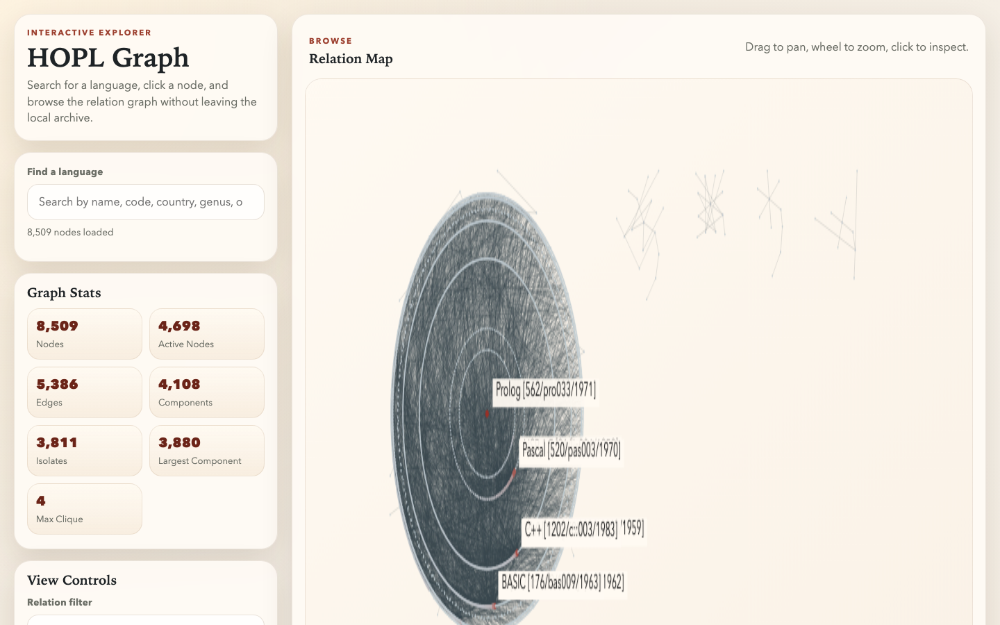
</div>
</div>

Note: Graph viewer and CSV exports were built from the scrape (hopl-scrapping repo). Great for lineage: you can follow Icon back to SNOBOL. HOPL's own homepage claims 8,945 entries; we recovered 8,509 through year and alphabetical indexes. The date distribution stops in the early 2000s.

---

## PL-ultimate: ~12,600 names from 7 sources <span class="sub">Mirror 2 · catalogs &amp; tools</span>

<div class="cols" style="align-items: flex-start">
<div style="flex: 1.1">

| Source | # | Its view of "a language" |
|---|--:|---|
| Esolang | 6,797 | esoteric, experimental, jokes |
| PLDB | 5,288 | curated metadata |
| Linguist | 878 | detectable on GitHub |
| Wikipedia | 769 | encyclopedic article |
| Hyperpolyglot | 670 | Linguist, in Rust |
| Pygments | 645 | someone wrote a lexer |
| Rosetta Code | 640 | solved toy tasks |

</div>
<div class="left" style="flex: 0.9">

<span class="big">12,608<small>entities in the union (11,963 in the first build; + source updates, Wikidata)</small></span>

- **88%** appear in **one** source only (Esolang 6,366, PLDB 4,034)
- Near-duplicates survive: `Python` / `py` / `Python (programming language)`
- Extensions for only **~10%** of them

</div>
</div>

Note: acherm/PL-ultimate, rebuilt inside PL-ultimate-llm. Counts are per source as rendered on the site's Sources page. Each source is opinionated: Esolang dominates by sheer size, Linguist by GitHub's worldview. 88% single-source is measured over the 12,748 site pages that have at least one upstream source. Nothing in the union is code.

---

## PL-ultimate-llm: LLMs contribute through commits <span class="sub">Mirror 3 · what LLMs know</span>

<div class="cols" style="align-items: center">
<div class="left smaller" style="flex: 0.92">

**One turn = one commit**: read the list, propose a real language **not yet in the list**, give an evidence URL and a program; git hooks validate; trailers record which model did it.

<p><span class="pill y">3,862 languages</span> <span class="pill y">3,846 commits</span> <span class="pill">since Oct. 2025</span><br>
<span class="pill b">Claude 3,392</span> <span class="pill b">Grok 246</span> <span class="pill b">Gemini 144</span> <span class="pill b">Llama 48</span> <span class="pill b">GPT 32</span> <span class="pill b">DeepSeek 9</span></p>

| | in the LLM list | not in it |
|---|--:|--:|
| in ≥ 1 of the 7 sources | 2,439 | 10,400 |
| in none of them | **1,403** | — |

<p class="smallest">= the 14,242 pages. Icon sits in the top-left cell: PLDB, Pygments and Rosetta Code had it, the LLM list did not.</p>

</div>
<div style="flex: 1.08">
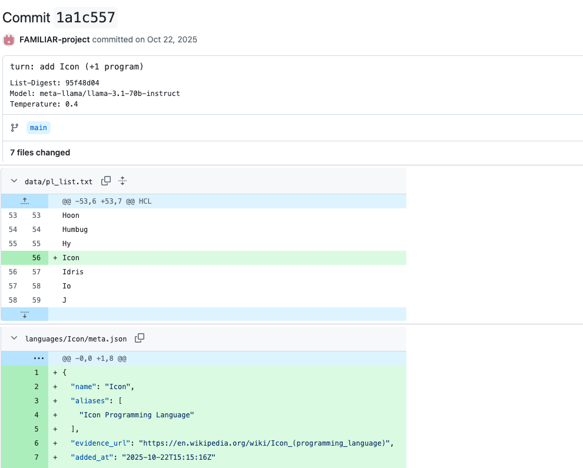
<p class="smallest center" style="margin-top: 0.2em">github.com/acherm/PL-ultimate-llm/commit/1a1c557</p>
</div>
</div>

Note: The LLM list started from a single entry (Kotlin, 22 Oct 2025) and was never seeded from the union: every entry was proposed by a model (or, lately, a form). The game only checks novelty against its own list, which is why the Llama turn could "discover" Icon although three catalogs had it. The commit is the unit of contribution: it adds the name to pl_list.txt, a meta.json with the evidence URL, the program and its manifest, and its trailers (List-Digest of the list the model saw, Model, Temperature) are the provenance. Claude dominates because of the automated Claude Code campaigns. So the 14K pages = 10,400 union-only + 2,439 in both + 1,403 names that no upstream source has: are those real?

---

## Do LLMs invent languages? We checked the evidence <span class="sub">All 3,842 evidence links of the LLM list, tested in September 2026</span>

<div class="cols" style="align-items: flex-start">
<div class="left smaller" style="flex: 1.05">

- **2,439** (63%) are also in one of the 7 sources; of the **1,403** others, **277** are in HOPL or Synid
- **Evidence links are fragile**: **28%** of the Wikipedia links point to a page that does not exist (**40%** for LLM-only names); others land on the wrong page (Brython → *Ancient Celtic people*)
- A missing page ≠ a fake language: *Aardappel (programming language)* has no page, yet Aardappel exists
- **465** names stay unverified: broken or off-topic evidence, no corroboration

</div>
<div style="flex: 0.95">
<div class="findings gap">

### Web check of 40 random unverified names

<p><span class="gapnum">36</span> are real languages: 27 as named, 9 under another name (Gringo, SPU assembly, ObScript…). Only their evidence link was wrong.</p>
<p><b>2</b> are real, but not languages: NATJ (a Java binding library), Brython (a Python 3 implementation)</p>
<p><b>2</b> not found, likely invented: BASIC-D, Oxymoron</p>

</div>
<p class="smaller" style="margin-top: 0.5em">≈ 5% of the 465 (95% CI 1–17%): about <b>23 invented names in 3,842</b> (0.6%, at most 2%).<br><b>LLMs invent evidence far more often than languages.</b></p>
</div>
</div>

Note: ⏱ T+7:10 — How: Wikipedia links checked with the Wikipedia API (2,112 titles, page existence, disambiguation, short description), GitHub links with the GitHub API (503 of 554 repositories exist), all other links with an HTTP request (644 of 797 resolve), names matched against HOPL's 8,509 names and Synid's 1,114 syntaxes. The 40-name sample (random, seed 7) was checked by web search, each verdict backed by a URL: 27 exist as named, 9 exist under another name, 2 are real but not languages, 2 were not found (BASIC-D: no Data General dialect of that name; Oxymoron: no esolang, only an unrelated pseudocode compiler). 2/40 = 5%, Wilson 95% CI 1.4–16.5%, i.e. 6 to 77 of the 465 unverified names, ≈ 23 as a point estimate: 0.6% of the list (at most 2%), assuming names that are corroborated or have working evidence are real. The lesson: models invent evidence much more than they invent languages, and checking is cheap and automatable: it should run on every contribution, with the result shown on the page. Script and outputs: analysis/llm_evidence_check.py, analysis/out/.

---

## Software Heritage: every extension, counted <span class="sub">Mirror 4 · the archive</span>

<p class="smaller">Roberto's CSV (SWH-MSR-ARV: Desmazières, Di Cosmo, Lorentz, MSR 2025): <b>2.96 M</b> extensions, occurrences per year</p>

| Extension | Occurrences in SWH | Claimed by |
|---|--:|---|
| `.m` | 46.5 M | 12 claimants: Octave/MATLAB, Objective-C, Mercury, m4, Wolfram… |
| `.R` · `.r` | 21.5 M · 1.7 M | R (case-folding once lost 21.5 M files) |
| `.CBL` · `.cbl` | 192 K · 57 K | COBOL |
| `.icn` · `.icon` | 32 K · 19 K | Unicon · Icon (Pygments) |
| `.fsf` | 18 K | claimed by no language (in fact an embedded DSL) |

**Extensions, not languages. A count is not a program.**

Note: This is the view from below: real files, 1970 to 2023. But it counts filename suffixes. `.m` is claimed by a dozen languages; capital `.R` was once missed by lowercasing everything; `.fsf` has no claimant in Linguist yet is a coherent format (we'll see it).

---

## Four mirrors, one blind spot

<table class="matrix">
<thead><tr><th></th><th>names languages</th><th>lineage</th><th>extensions</th><th>real programs</th><th>maintained</th></tr></thead>
<tbody>
<tr><td><b>HOPL</b></td><td><span class="ok">✓</span> 8,509</td><td><span class="ok">✓</span> 5,386 links</td><td><span class="ko">✗</span></td><td><span class="ko">✗</span></td><td><span class="ko">✗</span> frozen ~2005</td></tr>
<tr><td><b>PL-ultimate</b></td><td><span class="ok">✓</span> 12,608</td><td><span class="half">◐</span> infoboxes</td><td><span class="half">◐</span> 10% of names</td><td><span class="ko">✗</span> toy tasks</td><td><span class="ok">✓</span> upstream</td></tr>
<tr><td><b>PL-ultimate-llm</b></td><td><span class="ok">✓</span> 3,862</td><td><span class="ko">✗</span></td><td><span class="ko">✗</span> rarely</td><td><span class="half">◐</span> generated</td><td><span class="ok">✓</span> agents, forms</td></tr>
<tr><td><b>SWH extensions</b></td><td><span class="ko">✗</span> suffixes only</td><td><span class="ko">✗</span></td><td><span class="ok">✓</span> 2.96 M</td><td><span class="half">◐</span> real, unattributed</td><td><span class="ok">✓</span></td></tr>
</tbody>
</table>

<p class="smaller" style="margin-top: 0.8em">No row has both <b>names languages</b> and <b>real programs</b>: nothing links a language to the programs that exist.<br>"Give me 10 real, non-toy <b>Mercury</b> programs, with citable provenance": today, impossible.</p>

Note: ⏱ T+8:10 — The diagnosis, cell by cell. HOPL: names and lineage, no files, frozen. The union: names, some facts from infoboxes, extensions for 10% of names, Rosetta Code toy snippets at best. The LLM list: names and generated programs, which prove what a model knows, not what exists. The archive: real files, but it only knows suffixes. For Mercury: HOPL knows it historically, PLDB has a record, Linguist says it claims `.m`, shared with MATLAB, Objective-C and others; SWH has 46 M `.m` files. The pieces exist; they are not linked.

---

<!-- .slide: class="section-slide" -->
# 2. The vision, made concrete
## An ontology, a prototype, and the identification problem

Note: ⏱ T+9 (block 2, ~4:30 min)

---

## Languages, evidence, programs <span class="sub">The ontology</span>

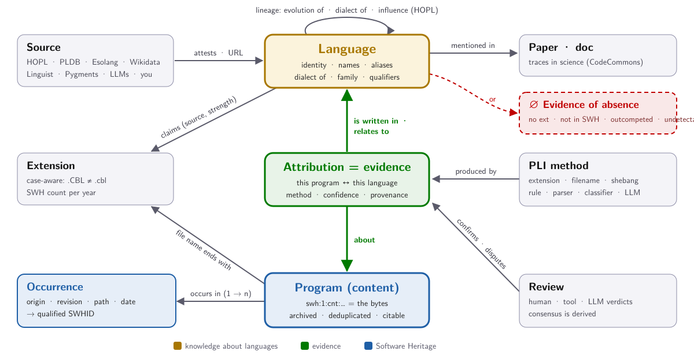

Note: ⏱ T+9 — The heart of the design. A language is never linked to a program directly: there is always an **attribution**, which records how (which PLI method: extension, heuristic rule, classifier, LLM judge), with what confidence, and from which provenance; reviews confirm or dispute it. An extension is a *claim* made by a source (Linguist says `.cob` is COBOL, primary), not a fact about files. A program is a deduplicated content (`swh:1:cnt`) that occurs in many repositories (qualified SWHID = origin + revision + path). Attribution is many-to-many: an `.fsf` file is a FEAT design *and* is written in Tcl. When no attribution survives, the language gets an evidence-of-absence verdict. In the repo: `pl.csv`, `pl_alias.csv`, `ext_claim.csv` (source, strength, evidence URL), `heuristic.csv`, `samples/<pl>/<sha1_git>/metadata.json`, `reviews/<sha1_git>/*.json`. Lineage comes from HOPL (scraped, not merged yet).

---

## PL, extension, program: it's all in the cardinalities <span class="sub">A UML view of the core concepts, as seen from Software Heritage</span>

<div class="cols" style="align-items: center; gap: 0.8em">
<div style="flex: 1.45">
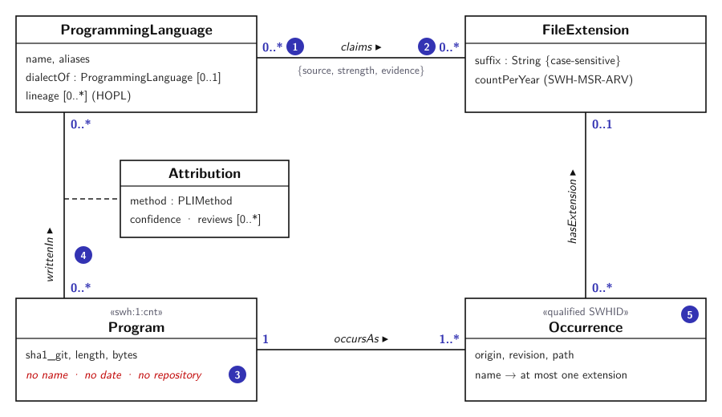
</div>
<div class="umlnotes" style="flex: 0.55">
<p><span class="n">1</span><b>A language claims 0..* extensions</b>: ~90% of catalogued languages claim none (esoteric, historical, no files); a few claim 10+ (Python, Ruby).</p>
<p><span class="n">2</span><b>An extension is claimed by 0..* languages</b>: <i>0</i> for most (88% of extensions with ≥1,000 files in SWH: <code>.map</code>, <code>.log</code>…); <i>*</i> is polysemy (<code>.m</code>: 12 claimants).</p>
<p><span class="n">3</span><b>Names live in directories</b>: an SWH program is just bytes, so the extension belongs to each occurrence, and one program occurs in many places.</p>
<p><span class="n">4</span><b>writtenIn is established per program</b>, with a method and a confidence, never inferred from a claim: 46% of <code>.cbl</code>/<code>.CBL</code> files are not COBOL.</p>
<p><span class="n">5</span><b>Counting = choosing a class</b>: programs (by file) or origins (by repo); a new revision is a new program.</p>
</div>
</div>

Note: ⏱ T+10 — The subtle core. (1)–(2) `claims` is many-to-many and mostly empty on both sides: most languages have no extension at all (esoteric and historical ones never had files), and most extensions found in the archive belong to no identified language (logs, caches, build artefacts… and some unknown DSLs); when several languages claim the same extension, that is polysemy. (3) In Software Heritage a program (content, swh:1:cnt) is only bytes: the file name, hence the extension, belongs to a directory entry, i.e. to an occurrence (origin, revision, path); identical bytes are stored once and occur in many repositories. (4) `writtenIn` is what we want; it must be established for each program, by a method with a confidence and reviews (the Attribution association class), and is never implied by `claims`. (5) Every statistic chooses what to count: programs or origins; this is why by-file and by-repo results disagree (part 3).

---

## Two gaps, in numbers <span class="sub">Languages without extensions, extensions without languages</span>

<div class="cols" style="align-items: center">
<div class="left" style="flex: 1">
<div class="findings gap">

### Languages without extensions

<p><span class="gapnum">90%</span> of the 12,608 catalogued languages (11,366) claim <b>no</b> file extension: invisible to extension-based detection</p>

</div>
<div class="findings gap" style="margin-top: 0.5em">

### Extensions without languages

<p><span class="gapnum">88%</span> of the 18,120 extensions with ≥ 1,000 files in SWH (15,957) are claimed by <b>no</b> language; 56% of those with ≥ 100,000 files</p>

</div>
<p class="smaller" style="margin-top: 0.5em">Help label them: <b>/review/extensions/</b> lists <b>4,556</b> popular extensions (≥ 10,000 files) without a claimant, 2,805 of them with no evidence at all. <b>11</b> labels so far.</p>
</div>
<div style="flex: 0.95">

</div>
</div>

Note: ⏱ T+11:15 — The two sides of the `claims` association, measured. Languages: 1,242 of the 12,608 taxonomy entities have at least one claimed extension. Extensions: the SWH-MSR-ARV dataset has 2.96 M distinct extensions; 1,994 are claimed by some language (1,515 by exactly one, 44 by six or more). Most unclaimed popular extensions are not programming languages (.map, .log, .lock, .uasset, .pdb…), but someone has to say so, and the tail hides DSLs and configuration languages (.fsf was one of them). The review queue is ranked by popularity and lack of claims; labelling is one form, and the label vocabulary covers non-languages too (binary:*, data:*, build-artifact…). This is the most concrete way to help today.

---

## PLI, formally: learn <i>f</i>, one iteration at a time <span class="sub">Conceptualization</span>

<div class="cols" style="align-items: center; gap: 0.9em">
<div style="flex: 0.95">
<div class="card definition">
<h3>Definition (programming language identification)</h3>
<ul>
<li><b>Languages</b>, the labels: <i>L</i> = {ℓ<sub>1</sub>, …, ℓ<sub><i>n</i></sub>}, <i>n</i> ≈ 12,600, plus ⊥ (not a language, unknown)</li>
<li><b>Extensions</b>: <i>E</i> = {<i>e</i><sub>1</sub>, …, <i>e</i><sub><i>m</i></sub>}, <i>m</i> ≈ 2.96 M in SWH</li>
<li><b>Programs</b>: <i>P</i>, the SWH contents; <i>p</i> occurs with extensions ext(<i>p</i>) ⊆ <i>E</i></li>
<li><b>Claims</b>: <i>C</i> ⊆ <i>L</i> × <i>E</i>, prior knowledge (catalogs, PLI tools)</li>
</ul>
<p><b>Goal</b>: find <i>f</i> : <i>P</i> × <i>E</i> → 2<sup><i>L</i></sup> such that <i>f</i>(<i>p</i>, <i>e</i>) = writtenIn(<i>p</i>): usually one ℓ, ∅ for ⊥, several for embedded languages</p>
<p><b>Knowledge</b>: labelled examples <i>D</i> = {(<i>p</i>, <i>e</i>, ℓ)}, claims, rules, grammars, models</p>
<p><b>Quality</b>: precision, recall, F1 of <i>f</i> on <i>D</i>, per language and per extension</p>
</div>
</div>
<div style="flex: 1.05">
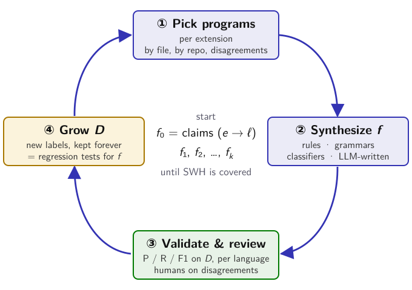
</div>
</div>

<p class="smaller" style="margin-top: 0.5em">Not a chicken-and-egg problem (programs to learn <i>f</i>, <i>f</i> to find programs), but an <b>iterative process</b>: bootstrap from claims and a few labelled programs; every validated label becomes a <b>regression test</b>; examples and knowledge accumulate <b>across all of SWH</b>.</p>

Note: ⏱ T+12:30 — The problem, stated precisely. n languages are the labels (plus ⊥ for "not a language / unknown"), m extensions, and the programs of the archive. An extension is a property of an occurrence, so a program comes with a set of extensions. PLI is learning a function f that, given a program and the extension it was seen with, returns the language(s) it is written in: set-valued, because a file can be in no language (data, fixtures) or several (an embedded DSL, COBOL with EXEC SQL). f needs knowledge: labelled examples first, then claims, rules, grammars, models. It looks like a chicken-and-egg problem: to find the programs of a language we need a recogniser, and to build the recogniser we need programs. In practice it is an iterative process, and it is exactly what we did for COBOL, .fsf and RPG: start from f0 = the extension claims; pick programs (uniform and origin-diverse samples, and the disagreements); synthesize a better f (hand-written or LLM-written rules, Tree-sitter grammars, classifiers bootstrapped from LLM labels); validate it against the labelled set with precision/recall/F1 and review the disagreements; add the new labels to D. D never shrinks: each label is a regression test that the next f must still pass (the RPG study froze its heuristics before the bulk run for this reason). And the knowledge carries over: labels gathered for one extension help the next one, across the whole archive. The funnel (next slide) is the architecture of f at archive scale.

---

## Which language is this file in? A multi-level funnel <span class="sub">Programming language identification (PLI)</span>

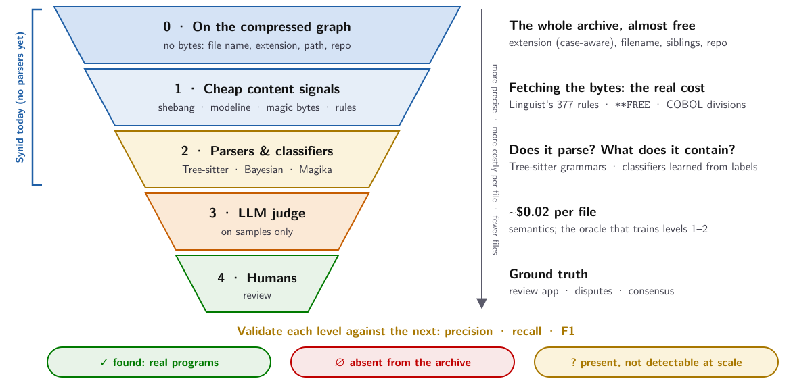

<p style="font-size: 0.6em; margin: 0.1em 0 0">PLI tools know <b>~1,100</b> syntaxes, Tree-sitter several hundred grammars; we catalogue <b>~12,600</b> languages, <b>~90%</b> with no known extension. Difficult, and fascinating.</p>
<p class="smallest" style="margin: 0.35em 0 0"><b>Ongoing work</b>, DiverSE team (Rennes): Caroline Landry, Mathieu Acher, Axel Amour N'cho, Baptiste Mehat, Bignon Lokonon, Corentin Ollivier, Guillaume Claudic, Stephan Kunne</p>

Note: ⏱ T+13:45 — Coarse but efficient filters first, runnable on the compressed graph without touching bytes (file names, extensions with their case, paths, sibling files, repository context). Then costlier, more precise filters on content: shebangs, modelines, Linguist's 377 disambiguation rules, study-specific markers (`**FREE`, COBOL divisions, `set fmri(`). Then parsers and classifiers: Tree-sitter grammars (does the file parse with a candidate grammar, with how many error nodes? and, once it parses, what does it contain: the concrete syntax tree gives the features a program uses, which is exactly what the extension studies need), Linguist/Hyperpolyglot Bayesian classifiers, Magika, our reclassifiers bootstrapped from LLM labels (COBOL: F1 0.88 against the judge). Tree-sitter is the incremental parser generator behind many editors (Neovim, Helix, Zed) and GitHub code navigation; the community list of grammars has several hundred entries, mostly for mainstream languages. Then the LLM judge on samples, humans for ground truth. Every level must be validated against the next one (precision/recall/F1). SWH's own Synid (CodeCommons, Rust) already runs levels 0–1 and a Bayesian classifier on the compressed graph, with 8 strategies (no parser-based strategy yet) (filename, extension, Linguist, shebang, comment, Hyperpolyglot heuristics, Bayesian classifier, Pygments heuristics) and a dictionary of 1,114 syntaxes merged from Linguist, Pygments, Hyperpolyglot, codestats. Cross-check: 151 of Synid's syntaxes appear in none of our catalogs (119 niche languages). We will very likely find that some languages are simply absent from the archive, or not detectable at scale. This is the direction the DiverSE team is taking right now (names on the slide).

---

<!-- .slide: class="section-slide" -->
# 3. Zoom in
## What is *actually* in file extension X, in all of Software Heritage?

Note: ⏱ T+14:45 (block 3, ~5 min) — A different and complementary contribution: not breadth (12K languages) but depth (one extension, its whole population). MSR-style.

---

## One extension, all of it <span class="sub">A complementary, MSR-style contribution</span>

<div class="cols" style="align-items: flex-start">
<div class="left smaller" style="flex: 1">

**Why?** Low-resource languages:

- understand **real usage** and the ecosystem
- build **benchmarks**, **fine-tune** LLMs
- find **interesting repositories**

**Input** (thanks Roberto, Valentin, Baptiste): *every* SWH file with extension X **+ its origin**, extracted from the graph with CodeCommons tools

SWH ≫ GitHub, but reading it takes method.

</div>
<div class="left smaller" style="flex: 1">

1. **Sample**: by file *and* by repository
2. **Fetch** bytes by SWHID (cached)
3. **Indicators**: cheap, deterministic
4. **LLM-as-judge**: enum-constrained
5. **Reclassifier**: zero-cost, validated vs. the judge
6. **Origins**: provenance, concentration
7. **Human review**: all labels side by side

<p class="smallest">~70% of the toolkit is reused from one extension to the next</p>

</div>
</div>

Note: Reports: docs/cobol_swh_study.pdf, fsf_swh_study.pdf, rpgle_swh_study.pdf, plus a playbook (docs/swh_extension_study_playbook.md). `.m` is in progress. Content→origin is NOT in the SWH REST API: it needs the graph, which is why the extractions with origins are so valuable.

---

## Three extensions, three stories

| | `.cbl` · `.CBL` | `.fsf` | `.rpgle` |
|---|---|---|---|
| unique files · repos | 276,831 · 6,278 | 21,802 · 757 | 13,002 · 534 |
| **really the language?** | <span class="ko">54% COBOL</span> | an **embedded DSL** (FSL FEAT, in Tcl) | <span class="ok">99.5% ILE RPG</span> |
| what else is in there | one GitLab test fixture (40%), comic-book lists | GLSL shaders, DataLad pointers | parsers *for* RPG: 21% of all files |
| the story | contamination, **case matters** | **fMRI** analysis designs; **polysemy** | the **sampling frame** decides |

<p class="smaller">Next: <code>.m</code> (MATLAB/Octave/…), and any extension you care about.</p>

Note: Three very different outcomes with the same pipeline. COBOL: dirty. fsf: an embedded DSL for neuroimaging, the FSL FEAT design files that parametrise fMRI analyses, expressed as Tcl `set fmri(...)` statements, with a tail of GLSL fragment shaders and DataLad pointers. RPG: clean, so the interesting question becomes "which RPG?".

---

## Lesson 1: an extension is a claim, not a fact

<div class="cols" style="align-items: center">
<div style="flex: 1.05">

</div>
<div class="left smaller" style="flex: 0.95">

- **46%** of `.cbl`/`.CBL` files are **not COBOL** (95% CI 42.5–48.7)
- ~110,000 files say *"This is cobol file number N"*: one GitLab repo, a test fixture for huge trees
- `.CBL` ≠ `.cbl`: mainframe enterprise vs learners (+ Calibre comic-book lists)
- …yet **93%** of the repositories do contain COBOL

</div>
</div>

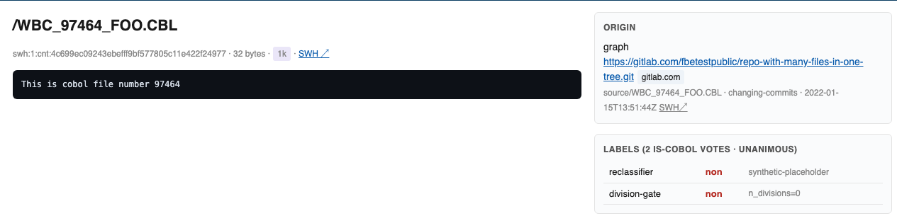

Note: Found by reading content, explained by provenance: the origin panel names the fixture repository (gitlab.com/fbetestpublic/repo-with-many-files-in-one-tree). One rule in the review tool labels the whole origin at once. Case: the archive preserves it, our mappings folded it.

---

## Lesson 2: how you count changes the story

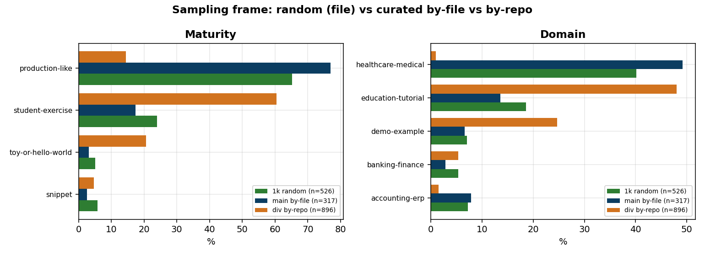

<div class="cols left smaller" style="align-items: flex-start">
<div>

- **by file**: 77% production-like, 49% healthcare (one system, JMA ORCA, hundreds of files)
- **by repository**: 14% production-like, **60% student exercises**, median 48 LOC (vs 596)

</div>
<div>

- **71 repositories** (1.1%) hold 80% of all COBOL-extension files
- "Typical **file**" ≠ "typical **project**": report both (same story for RPG, next)

</div>
</div>

Note: 71 repositories hold 80% of all COBOL-extension content. A by-file sample is in effect a sample of those 71 repositories; a by-repo sample (≤1 file per repo, 1,000 of 6,278 repos) is a sample of projects. Diagnose which skew you have before re-sampling.

---

## `.rpgle`: a clean extension, a biased archive

<div class="cols" style="align-items: center">
<div class="left smaller" style="flex: 0.95">

- **IBM RPG** (1959), still in production on IBM i; `.rpgle` = ILE RPG / RPG IV
- **13,002** files · **534** repos · **99.5%** genuine RPG: an honest extension
- One language, **three formats**: fixed (column-based), hybrid, fully-free (`**FREE` on line 1)
- **Which RPG?** Fixed-format: **41%** by file, **22%** by repo. Fully-free: 30% → **49%**
- Why: three **parsers *for* RPG** (an interpreter, two ANTLR grammars) hold **21%** of all `.rpgle`, 92% fixed-format test fixtures
- File versions (35% of contents) do **not** bias: 41% → 42%

</div>
<div style="flex: 1.05">
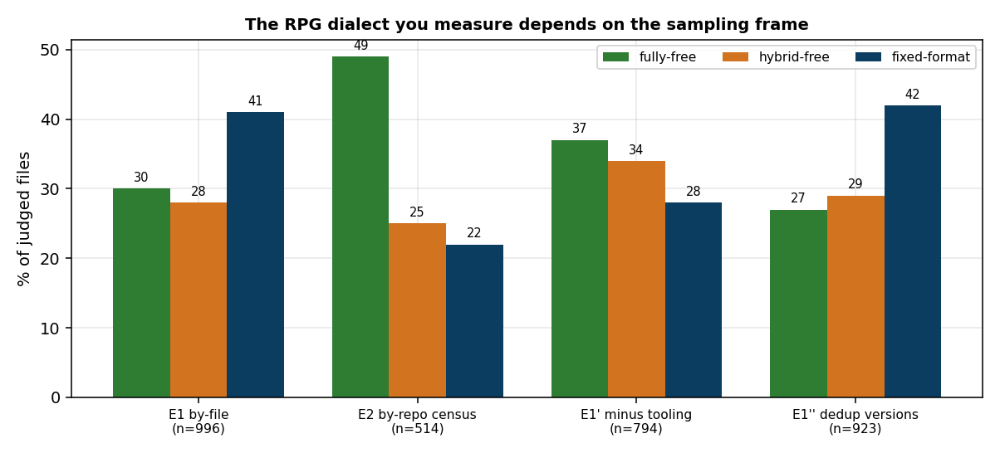
<p class="smallest">The archive's picture of RPG is shaped by the tools built to parse RPG.</p>
</div>
</div>

Note: ⏱ T+17:45 — Third study, first honest extension (1,476 files judged, $17.57). So the question becomes "which RPG?", and the answer depends on the frame. The cause is identified, not just observed: smeup/jariko (an RPG interpreter) plus two ANTLR grammars. Post-stratifying the same judged sample without these repos moves fixed-format 41% → 28% at zero cost. Versions: 34.7% of contents are later revisions of the same (repo, path) file; deduplicating barely moves the proportion. Repo concentration biases, version inflation only widens confidence intervals. Other findings: 19% of `.rpgle` are copy members (declaration-only headers); 19% relate to C (IBM i ports of libxml2, libssh2 binding C via EXTPROC); embedded SQL is rare (1.5% of files).

---

## Lesson 3: an LLM judge is a useful annotator, not an oracle

<div class="cols" style="align-items: center">
<div class="left smaller" style="flex: 1.15">

- **Enum-constrained** structured outputs (free text fragmented into 30+ spellings)
- Ask "what **is** this content, what does it **relate to**?", not "is it COBOL?"
- ~$0.02 per file: a study costs tens of dollars. **All of SWH: no way**
- → bootstrap **cheap classifiers**: COBOL reclassifier P 1.00 · R 0.79 · F1 0.88 vs. the judge
- RPG: the judge contradicts the literal `**FREE` directive on **9.1%** of files, one-sided (132 vs 2)
- **Code decides lexical facts, the LLM semantic ones, humans arbitrate**

</div>
<div style="flex: 0.85">

</div>
</div>

Note: The `related_languages` axis is what surfaced the fsf polysemy (Tcl host, GLSL shaders). The reflex is to treat expensive LLM labels as ground truth and "fix" the regex; for RPG that would have shipped a worse classifier. One-sided disagreement is the signature of a definition mismatch, not noise.

---

## From case studies to a method, and back

<div class="cards">
<div class="card hl">
<h3>An MSR contribution</h3>
<p><b>A general methodology</b> for "what is in extension X?"</p>
<ul>
<li><b>sampling</b>: by file, by repo, stratified… which question does each answer?</li>
<li><b>annotating</b>: LLM vs. PLI tools vs. ad-hoc/ML classifiers; the label problem</li>
<li><b>validating</b>, iterating until <i>all</i> files of an extension are covered</li>
</ul>
<p>+ <b>domain</b> contributions: COBOL (batch, CICS…), neuroimaging, IBM i, <code>.m</code></p>
</div>
<div class="card blue">
<h3>What it gives the encyclopedia</h3>
<ul>
<li>a <b>case-aware</b> extension → language mapping (<code>.CBL</code> ≠ <code>.cbl</code>, <code>.R</code> ≠ <code>.r</code>)</li>
<li><b>polysemy</b> made explicit: <code>related_languages</code>, <code>expressed_in</code></li>
<li><b>validated cheap classifiers</b> → evidence at archive scale</li>
<li>evidence of absence, <b>measured</b></li>
</ul>
</div>
</div>

<p class="smaller" style="margin-top: 0.7em">Encyclopedia = <b>breadth</b> (12K languages, a few programs each). Zoom-in = <b>depth</b> (one extension, its whole population).</p>

Note: ⏱ T+19 — Two outputs, two venues. Each case study deserves experts and specific motivations; the method is shared. Nice stories to tell about SWH and CodeCommons.

---

<!-- .slide: class="section-slide" -->
# 4. Making it real
## An official, sustainable SWH × CodeCommons initiative

Note: ⏱ T+19:30 (block 4, ~4:30 min) — Concrete: what exists for contributions, what is missing, how you can help.

---

## Contributions: trace everything, keep it discussable <span class="sub">Today's workflow is a prototype; the principle is what matters</span>

<div class="cols" style="align-items: flex-start">
<div style="flex: 1.3">

<table class="tight" style="font-size: 0.52em">
<thead><tr><th>Contribution</th><th>How</th><th>Lands as</th></tr></thead>
<tbody>
<tr><td>Propose a language</td><td>web form → GitHub issue <code>pl-add</code></td><td>PR, <b>merged on arrival</b></td></tr>
<tr><td>Label an extension</td><td>form on <code>/ext/&lt;x&gt;/</code> → issue <code>ext-review</code></td><td>accepted by default → <code>ext_claim</code></td></tr>
<tr><td>Ask for real programs</td><td>"Request SWH samples" → issue <code>sample-request</code></td><td>targeted SWH mining</td></tr>
<tr><td>Submit one file</td><td><code>submit_sample.py</code>, SWHID checked with <code>/known/</code></td><td><code>samples/&lt;pl&gt;/&lt;sha1_git&gt;/</code></td></tr>
<tr><td>Review a program</td><td>review UI, blinded; reviewer = human · tool · LLM</td><td>one immutable JSON per review</td></tr>
<tr><td>AI agents</td><td>parallel campaigns in git worktrees</td><td>one commit per language</td></tr>
</tbody>
</table>

<p class="smallest" style="margin-top: 0.5em">Today: forms → GitHub issues → pull requests, accepted by default, reverted if wrong. <b>The UI and the workflow are clunky, and will be redesigned.</b></p>
</div>
<div style="flex: 0.7">
<div class="card green" style="font-size: 0.6em">
<h3>What to keep</h3>
<ul>
<li><b>every contribution is a traced fact</b>: who, when, why, with which evidence</li>
<li><b>open to discussion</b>: each claim has a thread; disagreement is kept, not overwritten</li>
<li><b>revertible</b>; humans, tools and LLMs on the same footing</li>
<li>facts as files, aggregates derived</li>
</ul>
</div>
</div>
</div>

Note: Honest about the current state: the forms and the GitHub-issue workflow were quick to build but are not pleasant to use, and should be redesigned. What is worth keeping is the principle: everything is traced, explicit and open to discussion. The policy changed in May 2026: pl-add and pl-contribute PRs are merged automatically, extension labels are accepted automatically; the maintainer scans /review/recent/ and reverts if needed, rather than gatekeeping. Everything stays readable with `jq` if the tooling disappears. Reviews are append-only and keyed by content (sha1_git), so concurrent reviewers never conflict and disagreement is preserved; consensus is computed later (gold / silver / disputed). Every web form has a CLI twin planned.

---

## Challenges: what's missing

<div class="cards three">
<div class="card" style="grid-column: span 2; font-size: 0.66em">
<h3>Programming language identification (PLI) at archive scale: the central challenge</h3>
<ul class="twocol">
<li><b>Coverage</b>: PLI tools know ~1,100 syntaxes (Linguist, Pygments, Synid), Tree-sitter several hundred grammars; we catalogue ~12,600 languages, 90% without an extension</li>
<li><b>Ambiguity</b>: 44 extensions have 6+ claimants (<code>.m</code>, <code>.h</code>, <code>.pl</code>, <code>.t</code>); ~70 with several primary claimants have no disambiguation rule</li>
<li><b>No ground truth</b>: no benchmark measures PLI tools on SWH, per language; reviews and extension studies can build one</li>
<li><b>Scale</b>: billions of files: cheap filters on the compressed graph, costly ones on content, every level validated (P / R / F1)</li>
</ul>
</div>
<div class="card red">
<h3>Identity</h3>
<p>a canonical language ID authority, an "ORCID for languages"; merge <code>Python</code> / <code>py</code> / …; bring HOPL's genealogy in</p>
</div>
<div class="card red">
<h3>SWH-native evidence</h3>
<p>per-extension <b>extractors</b> (every file + origin, from the SWH graph) are costly: CodeCommons tools, so far run for <code>.cbl</code>, <code>.fsf</code>, <code>.rpgle</code>; then a <b>complete mapping</b> of SWH programs (a laptop scan: killed after 6.8 h)</p>
</div>
<div class="card red">
<h3>Evidence cards</h3>
<p>for all ~12,600 languages, with a formal evidence-of-absence verdict</p>
</div>
<div class="card red">
<h3>Governance &amp; hosting</h3>
<p>who curates? what counts as a language? data license? Today: one person's repo + GitHub Pages</p>
</div>
</div>

Note: PLI comes first because everything else depends on it: without a reliable, validated way to say which language a file is in, there is no evidence card, no usage statistic and no evidence of absence. The prototype is prototype-quality, deliberately documented so the design can be criticised (docs/SOURCES_AND_SWH_EVIDENCE.md, SWH_EXTENSIONS_DECISIONS.md). The expensive parts are exactly the ones where SWH and CodeCommons have the infrastructure: graph, provenance, derived datasets, compute near the data.

---

## How you can help, concretely

<div class="cards">
<div class="card blue">
<h3>🏛️ SWH / CodeCommons infrastructure</h3>
<ul>
<li>run the CodeCommons extractors on more extensions (as for <code>.cbl</code>, <code>.fsf</code>, <code>.rpgle</code>), towards a complete mapping</li>
<li>a per-extension index in the derived datasets</li>
<li>graph / provenance access; a neutral home</li>
</ul>
</div>
<div class="card hl">
<h3>🔬 Domain experts: adopt an extension</h3>
<ul>
<li>COBOL, neuro <code>.fsf</code>, <code>.m</code>, IBM RPG… or yours</li>
<li>dive deep: define the taxonomy, review, tell the story</li>
</ul>
</div>
<div class="card green">
<h3>🧪 PL / ML / MSR researchers</h3>
<ul>
<li>PL identification at archive scale: Tree-sitter grammars, classifiers, a PLI benchmark built from SWH</li>
<li>sampling &amp; labeling methodology</li>
<li>benchmarks, fine-tuning data for low-resource languages</li>
</ul>
</div>
<div class="card">
<h3>🙋 Everyone, one click</h3>
<ul>
<li>add a language · label an extension</li>
<li>review a program · flag a hallucination</li>
</ul>
</div>
</div>

Note: Adopt-an-extension is the unit of work: one extension, one expert, one report, and its results flow back into the encyclopedia. Name the people already involved on each case study here (COBOL, fsf/neuro, .m, RPG).

---

## Catch them all! <span class="sub">Gamifying the encyclopedia: programs and languages</span>

<div class="cols" style="align-items: center">
<div style="flex: 1.05">
<div class="dex">
<div class="t caught"><span class="ic">●</span><b>COBOL</b>2 on the site · ≈150K in the study</div>
<div class="t caught"><span class="ic">●</span><b>Perl</b>caught · 6 programs</div>
<div class="t caught"><span class="ic">●</span><b>Pascal</b>caught · 5 programs</div>
<div class="t caught"><span class="ic">●</span><b>Mercury</b>caught · 1 program</div>
<div class="t seen"><span class="ic">○</span><b>C</b>seen · not yet caught</div>
<div class="t seen"><span class="ic">○</span><b>Fortran</b>29 variants · none caught</div>
<div class="t seen"><span class="ic">○</span><b>Icon</b>5 catalogs · 0 programs</div>
<div class="t seen"><span class="ic">○</span><b>Smalltalk</b>6 sources · 0 programs</div>
<div class="t seen"><span class="ic">○</span><b>Brainfuck</b>6 sources · 0 programs</div>
<div class="t seen"><span class="ic">○</span><b>ALGOL 60</b>0 programs</div>
<div class="t seen"><span class="ic">○</span><b>Porth</b>found by an LLM</div>
<div class="t fake"><span class="ic">✗</span><b>BASIC-D</b>invented by an LLM</div>
</div>
<div class="dexbar"><span style="width: 1.5%"></span></div>
<p class="smallest center" style="margin-top: 0">192 of 12,608 languages caught (1.5%). A <b>pipeline gap</b> more than an archive gap: extracting every file of an extension from SWH is costly; CodeCommons extractors did it for <code>.cbl</code>, <code>.fsf</code>, <code>.rpgle</code>, not yet for the others.</p>
</div>
<div class="left smaller" style="flex: 0.95">

- **Catch** a language: attach its first verified program from SWH; every catch is reviewed, invented languages get caught out
- **Power-ups**: each per-extension extractor (CodeCommons) catches a whole extension at once: `.cbl`/`.CBL` alone yields ≈150,600 COBOL files
- **Rarity**: the fewer programs in the archive, the rarer the catch
- **Quests**: catch C and Fortran (still missing!), label <code>.flat</code>, check the 465 unverified LLM names
- **Collections**: a family (ALGOL's descendants), a decade, an extension
- **Leaderboards**: for people, and for models (the LLM game already counts 18)

</div>
</div>

Note: ⏱ T+21:10 — A way to make the work fun and to scale participation. The Pokédex is real data from the site: 192 languages have at least one verified program from Software Heritage; surprisingly, not C, not a single one of the 29 Fortran variants, not Smalltalk or Brainfuck. This says more about our pipeline than about the archive: the catalog's samples come from a 1% sample of one shard of the popular-content-names dataset, matched through GitHub; what is missing is the extraction step, i.e. getting every file of a given extension, with its origin, out of the SWH graph. That extraction is costly; CodeCommons is developing the tools, and they are exactly what powered the case studies (.cbl/.CBL, .fsf, .rpgle). One extraction changes the picture by orders of magnitude: COBOL has 2 programs on the site, but ≈150,600 genuine COBOL files in the .cbl/.CBL study. The next step is to feed these extractions into the catalog, and eventually a complete mapping of SWH programs to languages. So the easy catches are still open. Rarity makes the long tail attractive (a real Icon or ALGOL 60 program is worth more than the millionth C file). Quests come straight from the data: the review queue, the unverified names, languages without programs. The LLM game shows it works for agents too; the same mechanics can engage students, communities of a language, historians.

---

## Roadmap: an official SWH × CodeCommons initiative <span class="sub">Start with a name and a home, then grow incrementally</span>

<div class="roadmap">
<div class="stage s0">
<div class="chev"><span class="when">now</span>0 · Official &amp; online</div>
<ul>
<li>a <b>hostname</b> (DNS) for the encyclopedia</li>
<li>an <b>official SWH × CodeCommons initiative</b></li>
<li>a neutral home (org), a data license, curators</li>
</ul>
</div>
<div class="stage s1">
<div class="chev"><span class="when">next</span>1 · Start small</div>
<ul>
<li>the <b>reproducible build</b></li>
<li>canonical language IDs; merge HOPL</li>
<li>feed the CodeCommons extractions (<code>.cbl</code>, <code>.fsf</code>, <code>.rpgle</code>); adopt 3–5 extensions</li>
</ul>
</div>
<div class="stage s2">
<div class="chev"><span class="when">then</span>2 · Grow</div>
<ul>
<li>more extractors, a <b>PLI benchmark</b></li>
<li>evidence cards for all ~12,600 languages</li>
<li>open contributions: redesigned workflow, <i>catch them all</i></li>
</ul>
</div>
<div class="stage s3">
<div class="chev"><span class="when">later</span>3 · Scale</div>
<ul>
<li>a <b>complete mapping</b> of SWH programs to languages</li>
<li>usage over time, traces in papers (CodeCommons)</li>
<li>MSR paper (method), data paper</li>
</ul>
</div>
</div>

<div class="throughout"><b>Throughout: one reproducible pipeline.</b> Inputs of any kind (catalogs, HOPL, SWH datasets, PLI tools, LLMs, <b>human insights and reviews</b>) → site, datasets, evidence cards; rebuilt from scratch at any time, every number traceable to its inputs.</div>

<div class="findings" style="margin-top: 0.6em">

### Decisions for today

**Who's in?** · **Which hostname, which home?** · **Which extensions do we adopt first?**

</div>

Note: ⏱ T+22:45 — The ask, as a roadmap. Step 0 is small but decisive: a hostname for the encyclopedia and an official SWH × CodeCommons initiative, i.e. a name, a home that is not one researcher's GitHub account, a data license and a few curators. Then start small with what already works: the reproducible build, canonical language IDs, HOPL merged, the CodeCommons extractions of .cbl/.fsf/.rpgle fed into the catalog, a handful of adopted extensions. Then grow (more extractors, a PLI benchmark, evidence cards for every language, open contributions with a better workflow and the game) and eventually scale to a complete mapping of Software Heritage programs, with CodeCommons statistics on usage over time and traces in papers. The one non-negotiable property, from day one: the encyclopedia is the output of a reproducible pipeline, whatever its inputs are (sources, tools, LLMs, human insights and reviews), so that it can be rebuilt, audited and improved by anyone. A steady cadence helps (e.g. one extension study per month).

---

<!-- .slide: class="closing" -->
# Towards an encyclopedia of programming languages anchored in Software Heritage &amp; CodeCommons

<p class="slogan" style="font-size: 1em">Every language with its programs, every program with its language.</p>

<p style="font-size: 0.8em">From the beginning of computing to today, with Software Heritage as the source of truth for the code.</p>

<p class="smaller">PL Catalog: blog.mathieuacher.com/PL-ultimate-llm · github.com/acherm/PL-ultimate-llm<br>
Reports: <code>docs/cobol_swh_study.pdf</code> · <code>fsf_swh_study.pdf</code> · <code>rpgle_swh_study.pdf</code></p>

<p class="smallest">Thanks to Software Heritage (Thomas Aynaud, Roberto Di Cosmo, Stefano Zacchiroli, Valentin Lorentz) for feedback, assistance and the SWH extractions; to the DiverSE team (Rennes) and the PLI group (Caroline Landry, Axel Amour N'cho, Baptiste Mehat, Bignon Lokonon, Corentin Ollivier, Guillaume Claudic, Stephan Kunne); and to everyone who will adopt an extension.</p>

<div class="logos">


<span style="font-weight: 700; font-size: 0.6em; margin-left: -1em">CodeCommons</span>


</div>

Note: ⏱ T+24 — Thank you. Backup slides follow (press O for the overview).

---

<!-- .slide: class="section-slide backup-start" -->
# Backup

---

## Backup · polysemy: an extension is not a language

<div class="cols" style="align-items: center">
<div style="flex: 1">

</div>
<div class="left smaller" style="flex: 1">

- `.m`: **46.5 M** files, **12 claimants**
- Linguist's **377** disambiguation rules, made **runnable**: "Mercury, because `:- module` matched"
- Then `XSetModifierMapping.m` (Xorg) is… **none of them**: an xts5 test-case format
- `.icn` → Unicon, `.icon` → Icon, but Icon sources are `.icn`

**Classify content. Keep the provenance of every claim.**

</div>
</div>

Note: Polysemy is the rule, not the exception. And the heuristics encode GitHub's worldview: for the long tail (~70 ambiguous extensions without any rule) we need new classifiers, possibly bootstrapped by LLMs.

---

## Backup · the central idea, operationally

<p class="smaller">For each language, Software Heritage is the <b>source of truth for the code</b>:</p>

<div class="cards three">
<div class="card green">
<h3>✓ Evidence of existence</h3>
<ul>
<li>≥ K <b>real archived programs</b></li>
<li>each with a <b>qualified SWHID</b>: citable, permanent</li>
<li>and <b>why</b> it was attributed: extension? heuristic rule? classifier? human?</li>
</ul>
</div>
<div class="card red">
<h3>∅ Evidence of absence</h3>
<ul>
<li>no extension claimed anywhere</li>
<li>extension claimed, absent from SWH</li>
<li>files exist, but always won by a competitor (Mercury vs MATLAB on <code>.m</code>)</li>
</ul>
<p>A result in itself.</p>
</div>
<div class="card blue">
<h3>⟳ Then, at CodeCommons scale</h3>
<ul>
<li>usage statistics</li>
<li>evolution over time: birth, peak, decline</li>
<li>traces in scientific papers</li>
</ul>
</div>
</div>

<p class="smaller" style="margin-top: 0.7em"><b>Living</b>: humans, AIs and automatic procedures add, correct, validate. Goal: <b>every language, from the beginning of computing to today</b>.</p>

Note: The negative space matters: for the HOPL and Esolang long tail, "no trace in the archive" is publishable in itself. And anyone can say: this program is wrong, this language does not exist, you forgot this one.

---

## Backup · how the pieces fit

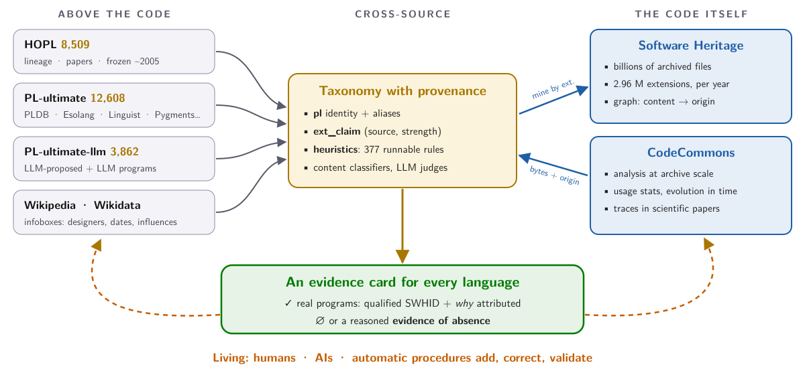

Note: Left: the views from above (names, lineage, facts). Middle: one taxonomy where every claim carries its provenance (who says `.rpy` is Ren'Py, primary or secondary). Right: the code, the graph (content → origin), CodeCommons for scale. Output: an evidence card per language. The dashed loop: every piece can be corrected by humans, agents, or scripts.

---

## Backup · the landscape, source by source

| Source | Size | Captures | Limitation |
|---|--:|---|---|
| HOPL | ~8,500 | lineage, papers | frozen ~2005, often down, no code |
| Esolang | ~6,800 | esoteric, experimental | many with ~zero usage |
| PLDB | ~5,100 | paradigms, dates, designers | sparse on real adoption |
| Linguist | ~800 | detection + ambiguity rules | GitHub's worldview |
| Pygments | ~600 | syntax highlighting | exists if someone wrote a lexer |
| Rosetta Code | ~560 | tasks × languages | toy snippets |
| PL-ultimate | 12,608 | union of 7 (+ Wikidata) | 88% single-source |
| PL-ultimate-llm | ~3,900 | LLM-proposed + programs | hallucination risk |
| SWH-MSR-ARV | 2.96 M exts | occurrences per year | extensions, not languages |

---

## Backup · a real program, cited

```text
swh:1:cnt:c5ecce87432c6b1e8465269cb9b15902fe0dc302
  ;origin=https://github.com/st3fan/osx-10.9
  ;anchor=swh:1:rev:9f8135f87c2ba27b1e76a514464b823812effd45
  ;path=/CPANInternal-140/DBIx-Class/t/resultset_overload.t
```

- `.t` is shared by Perl, Raku, Terra, Turing → Linguist rule `h/linguist/.t/0` matched → **Perl**
- The bytes were fetched at the pinned commit and their `sha1_git` verified; a git commit SHA **is** an SWH revision ID
- Verification of all samples via SWH `/known/`: content **261/261**, anchor commit **251/261**, origin **233/261**
- <span class="ko">Gap</span>: the "seen N× in SWH" count comes from a filename + length match, not a strict content-id match; fixing it needs the nodes table (~840 GB) or an SWH-side index

---

## Backup · the LLM contest protocol

<div class="cols" style="align-items: flex-start">
<div>

```text
turn: add Icon (+1 program)

List-Digest: 95f48d04
Model: meta-llama/llama-3.1-70b-instruct
Temperature: 0.4
```

</div>
<div>

```text
turn: add Forge (+1 program)

List-Digest: d2538df5
Model: claude-sonnet-4-6
Agent: claude-code
WebSearch: disabled
Strategy: batch-recall-100
```

</div>
</div>

- `List-Digest` pins the list the model saw; hooks reject duplicates (case-insensitive) and bad hashes
- 3,846 `turn: add` commits since Oct. 2025: Claude 3,392 · Grok 246 · Gemini 144 · Llama 48 · GPT/Codex 32 · DeepSeek 9 · Mistral 2
- Well-known languages are exhausted: agents now dig into regional languages, niche DSLs, historical systems

---

## Backup · `.fsf`: an embedded DSL for neuroimaging

<div class="cols" style="align-items: center">
<div class="left smaller">

- **FSL FEAT** design files: fMRI analysis configuration
- a **declarative DSL hosted in Tcl** (`set fmri(...) value`)
- 1,662 files judged: **99%** configuration / DSL rather than general-purpose code; Tcl in 77%
- provenance: OpenNeuro, neuroimaging labs; top repo 18%
- polysemy tail: **GLSL fragment shaders**, git-annex / DataLad pointers
- a one-line marker (`set fmri(`) agrees with the judge **100%**

</div>
<div>
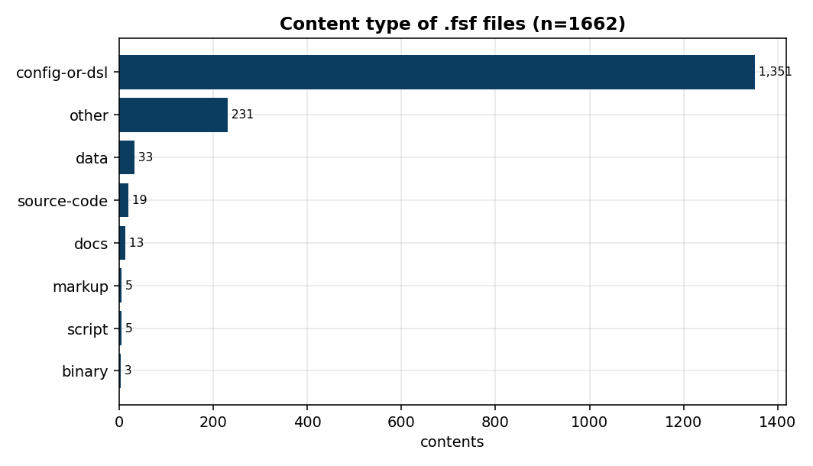
</div>
</div>

---

## Backup · the review app

<div class="cols">
<div>
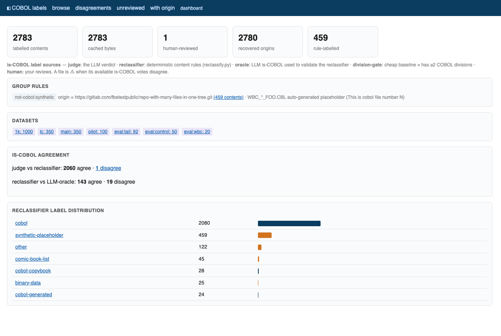
</div>
<div>
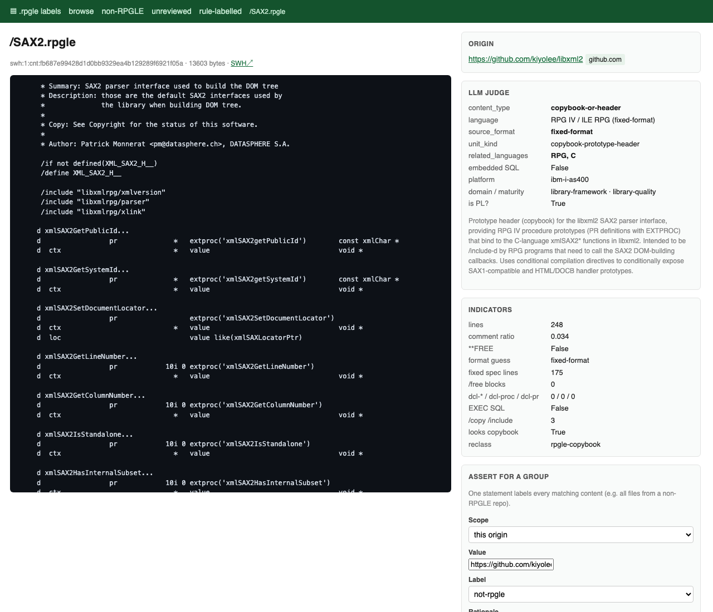
</div>
</div>

<p class="smaller">One pane over every label for a file: LLM judge · reclassifier · gate · human · origin. Disagreements are surfaced; group rules label a whole origin at once.</p>

---

## Backup · reviews as facts

```json
{
  "schema": 1,
  "subject": { "sha1_git": "f851a314…", "filename": "XSetModifierMapping.m", "ext": ".m" },
  "reviewer": { "kind": "human", "id": "mathieu-acher" },
  "verdict": { "label": "pl/new:tet-scenario", "confidence": "high", "supersedes": null },
  "comment": "xts5 TET 'mc' format: C embedded in >>CODE blocks.",
  "shown": { "claimants": ["pl/m4", "pl/matlab", "pl/mercury", "…"] },
  "created_at": "2026-06-12T09:31:02Z"
}
```

- `reviews/<sha1_git>/<stamp>--<reviewer>--<hash>.json`: one immutable file per review, never a merge conflict
- reviewers are **humans, tools or LLMs**; what the UI showed is recorded (anchoring-bias trace)
- consensus is **derived**, and can be recomputed under other rules
